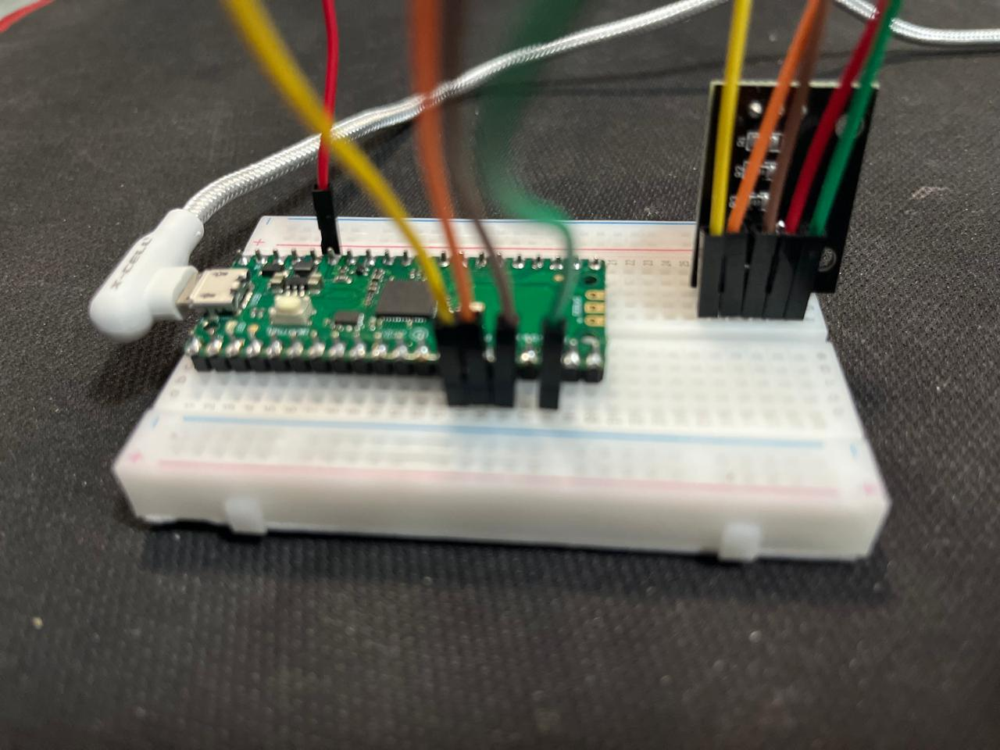
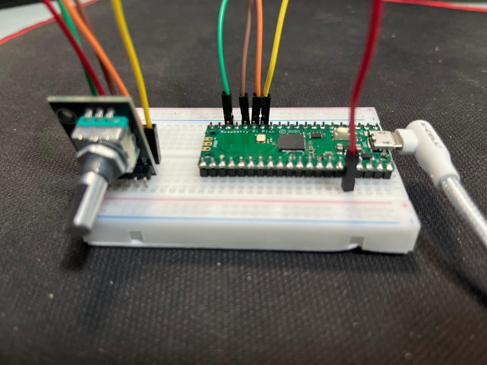
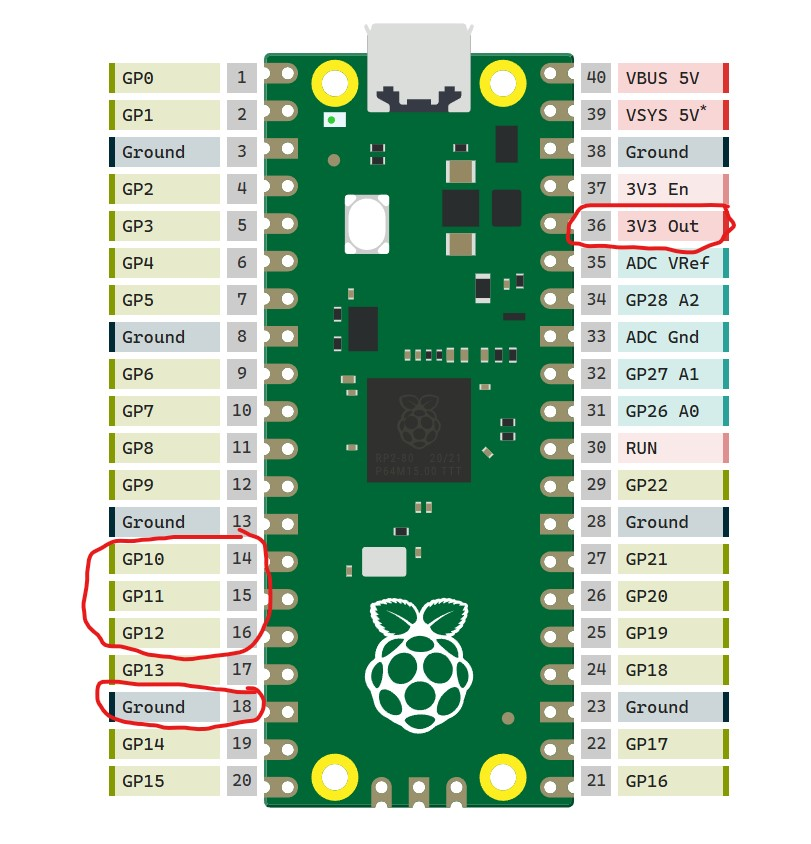
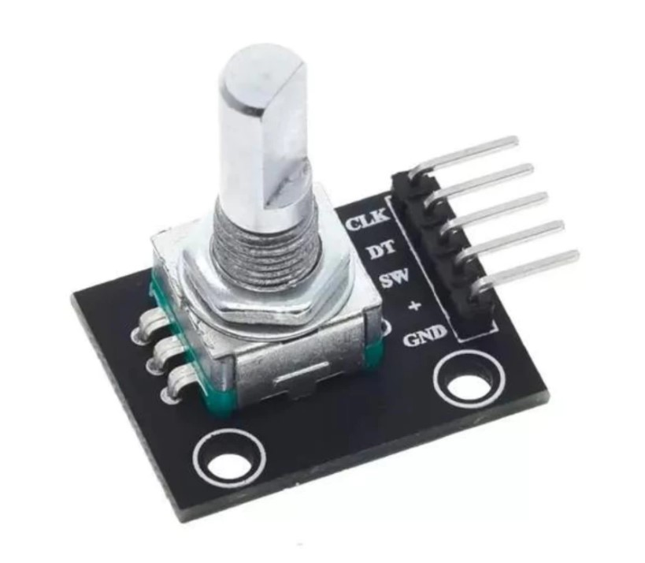

# Pico-Decoder

Este projeto demonstra como utilizar o **Raspberry Pi Pico** em conjunto com um **encoder rotativo**, detectando o sentido da rotação (horário e anti-horário) e cliques no botão do encoder.

## 🔧 **Componentes Utilizados:**
- **Raspberry Pi Pico 1 Series** - PROD13/PROD19/PROD23 [aqui](https://shpe.site/tecnologiaetrecos)  
- **Protoboard** - PROD38 [aqui](https://shpe.site/tecnologiaetrecos)  
- **Encoder rotativo (CLK, DT, SW)** - PROD36 [aqui](https://shpe.site/tecnologiaetrecos)  
- **5 Jumpers M x M** - PROD35 [aqui](https://shpe.site/tecnologiaetrecos)  
- **Cabo USB V8 Dados** - PROD17 [aqui](https://shpe.site/tecnologiaetrecos)  

---

## ⚡ **Ligaçãos**
Abaixo estão as imagens do circuito montado na protoboard:

  
*Imagem 1: Conexões principais no Raspberry Pi Pico e encoder.*

  
*Imagem 2: Detalhe das conexões do encoder (CLK, DT e SW) na protoboard.*

  
*Imagem 2: Detalhe raspberry pi pico 1 series*

  
*Imagem 2: Detalhe das conexões do encoder.*


---

## 📝 **Descrição do Código**
O código em C++ foi desenvolvido na plataforma Arduino. Ele realiza a leitura do encoder e exibe as informações no **Serial Monitor**, detectando:

- **CW (Clockwise):** Sentido horário  
- **CCW (Counter-Clockwise):** Sentido anti-horário  
- **Botão pressionado:** Detecta cliques no encoder  

---

## 🚀 **Como Usar**
1. Monte o circuito conforme o diagrama acima:  
   - **CLK** -> GPIO 10  - Pino 14 - 
   - **DT** -> GPIO 11  - Pino 15
   - **SW** -> GPIO 12  - Pino 16
   - **GND** -> Ground - Pino 18  
   - **3v3 Out** -> Ground - Pino 36  

2. Carregue o código `.ino` no Raspberry Pi Pico usando a IDE Arduino.
3. Abra o **Serial Monitor** (com baud rate 115200) para visualizar as informações de rotação e cliques.

---

## 📂 **Download do Código**
Você pode baixar o código diretamente [aqui](https://github.com/brunomlima/Pico-Decoder/blob/main/PICO_BOTAO_DECODER/PICO_BOTAO_DECODER.ino) ou cloná-lo para o seu computador:

```bash
git clone https://github.com/brunomlima/Pico-Decoder.git
